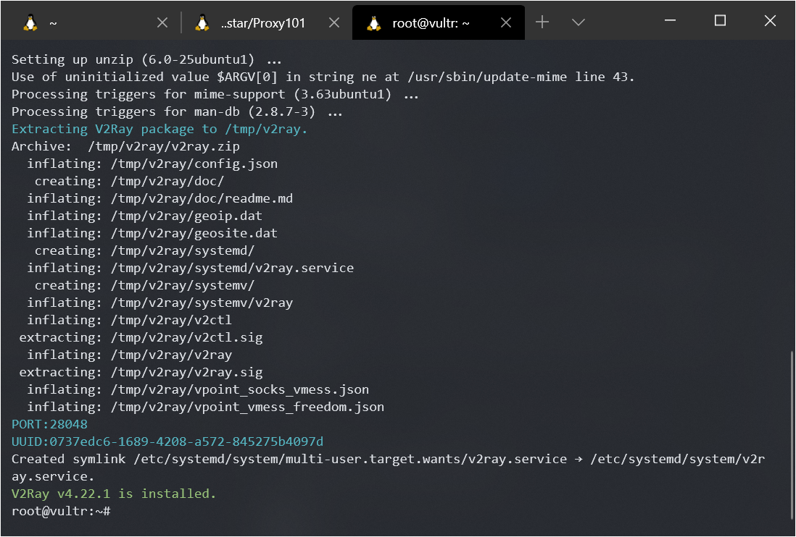
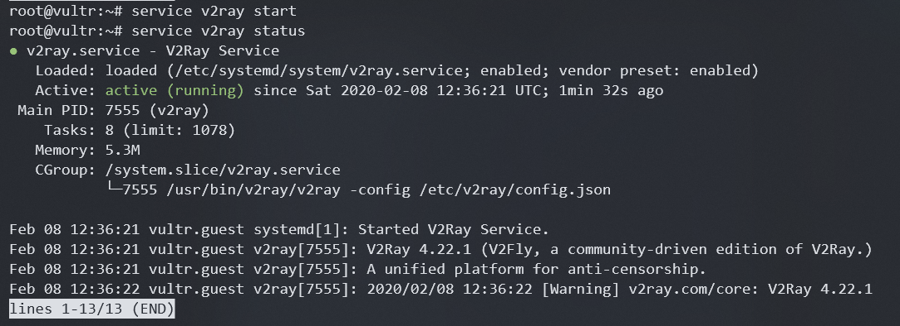

# Host Your Own Proxy Server

> 等天明

## 前言

这篇文章将会手把手带领你搭建一个属于自己的互联网代理服务。完成这一切，你只需要：

- 会使用鼠标
- 知道回车键的位置

让我们开始吧！

## 计算机网络 101

夜深人静的夜晚，小粉想访问 P 站 (philosophy-hub.com)，她兴奋地打开浏览器，输入网址，想要访问。在这个过程中，它的浏览器利用了如今遍布全球各地的互联网基础设施，试图向 P 站发出一个连接请求。

然而等待着她的，却是冰冷的回应。她站着访问，躺着访问，跪着访问，都访问不了。有一天，小红安利小粉一个神秘的软件，名字叫 V ，小粉启动 V，试着访问 P 站。诶，竟然成功了！聪明的小粉发现，V 是一款代理 (proxy) 软件。

小粉：“为什么我打开代理软件 V 就能上 P 站了呢？”  
小红：“这个代理软件，相当于一个中介。”  
“也就是说，它连接了我与 P 站？”  
“正是这样。你连接上代理服务器之后，当你要访问 P 站，你实际上是在访问代理服务器，并且告诉代理服务器，我要上 P 站。于是，代理服务器替你访问 P 站，并且把网页数据原模原样地发送给你，因此，你顺利地访问到了 P 站。”

## 你好，我是云服务器

现在我们知道了，为了达成目标，我们需要一台能够运行代理程序的服务器。那么在哪里才能买得到呢？（以下链接可能包含引荐）

- [Vultr](https://www.vultr.com/?ref=8425681-6G) 此链接赠金 $100，平台支持支付宝和微信支付 [2020-02-08]
- [Google Cloud Platform (GCP)](cloud.google.com) 如果你有外币信用卡，可获得免费 $300 赠金
- AWS
- 阿里云国际

下文以界面简单，新手友好的 Vultr 为例介绍。

### 与服务器做游戏

如果你没有登录服务器的经验，请[点这里](server.md)。

### 命令行 10 分钟速成

如果你没有使用命令行的经验，请[点这里](shell.md)。

## 安装代理服务器吧

现在，V2Ray 是一个较为流行的代理程序。我们要在我们的服务器上安装它。

V2Ray 官方提供了一键脚本，我们只要运行以下的命令，分分钟就能安装好：

```sh
bash <(curl -L -s https://install.direct/go.sh)
```



如果没有报错，就说明安装成功辣！

留意两行蓝字，一行为 `PORT`，一行为 `UUID`，把它们记在小本本上哦。

运行下面的命令启动 V2Ray

```sh
service v2ray start
```

查看 V2Ray 的运行状态：

```sh
service v2ray status
```



如果你看到了 `active(running)` 就说明 V2Ray 在成功运行啦！

打开 V2Ray 客户端，手动配置好地址(IP 地址)和前面记下的端口(PORT) 和 用户ID (UUID)，就可以连接上代理服务器了。

## 配置

🚧 still WIP

你可参考开源社区的教程[白话文教程](https://guide.v2fly.org/)

最后更新: 2020-02-08
