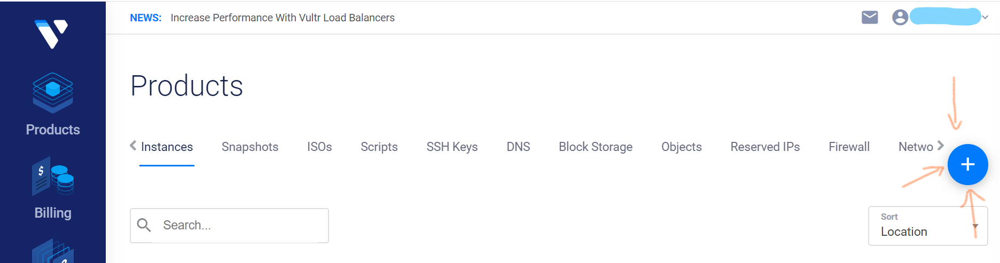
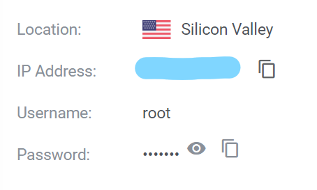
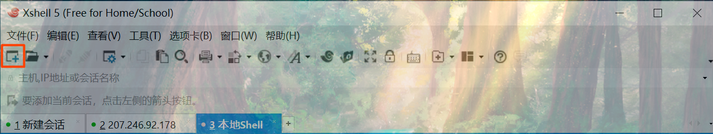
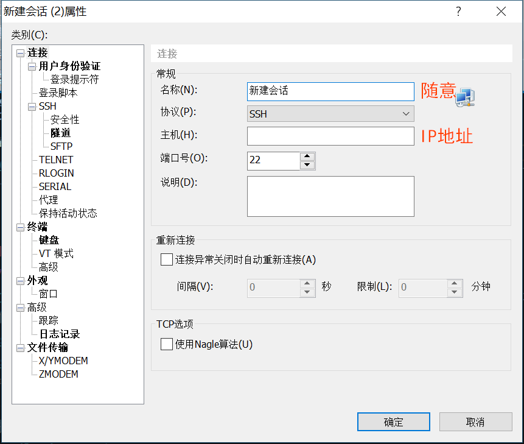
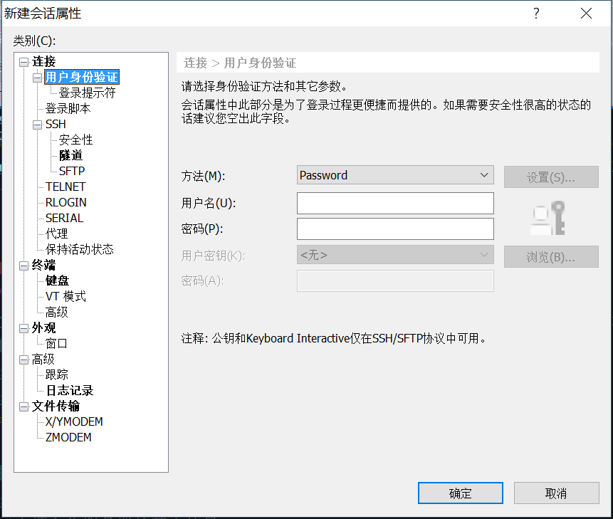
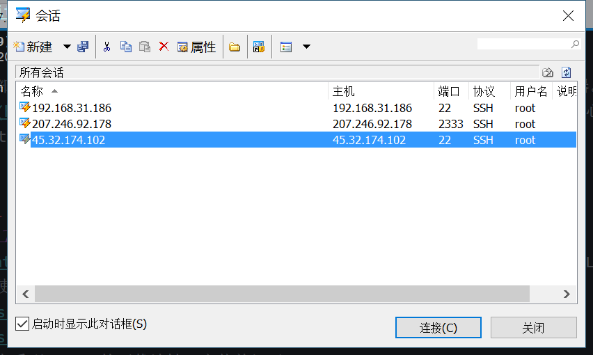
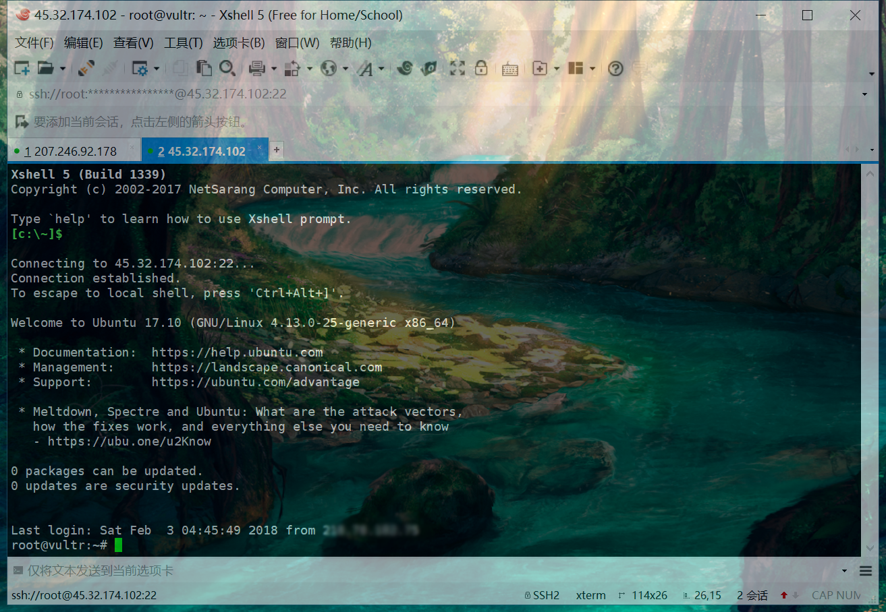

# 与服务器做游戏

## 部署新服务器实例

点击下图中大大的加号，部署一台新的服务器。

接下来的页面里，根据你的需要，选择服务器所在的地区、配置。需要注意的是，**Server Type** 建议选择最新的 **Ubuntu 19.10 x64** 或 **Debian 10 x64** [2020-02-08]. 其它选项默认即可。

最后，点击右下角的 Deploy Now. 等待一会，你的服务器马上就到。

## 登录服务器

回到首页，你会看到 Instances 下出现里一台新的服务器。点击它进入详情页。

进入详情页之后我们看到关于服务器的很多信息，现在我们需要关注的最主要信息就是服务器的 **IP 地址**、**用户名**和**密码**。

那么，如何才能登录服务器呢？这里推荐 [XShell](https://www.netsarang.com/zh/free-for-home-school/) 作为便捷的客户端。

点击右上角新建按钮。

在随后弹出的窗口中填入你服务器的基本信息。主机即是 IP 地址。

点击左栏中的用户身份验证,输入用户名（默认为`root`）和密码。

完成后，点击确定。在弹出的页面选择刚才新建的服务器，点击连接。

出现类似下图的内容就说明连接成功辣~

最后更新: 2020-02-08
