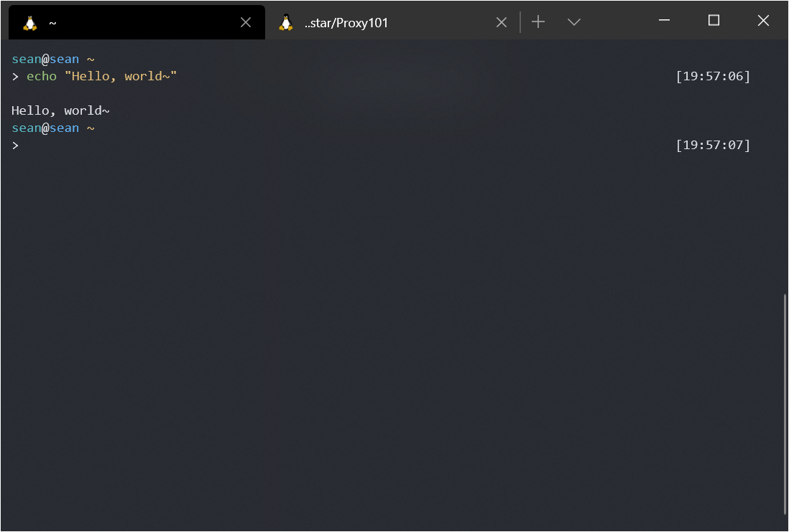
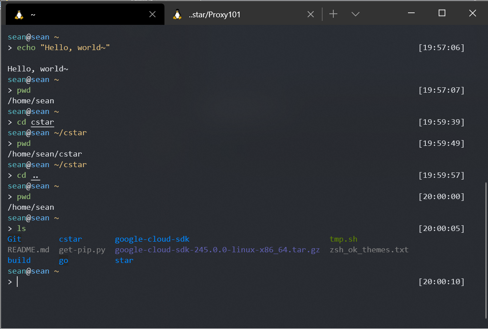

# 命令行速成课

呀！这黑漆漆的命令行界面好落后鸭！  

## 操作真的很简单

试着输入一条命令，来向世界打个招呼~

```sh
echo "Hello, world~"
```



## 还有哪些命令

在命令行里，你可以操作系统里的所有文件。 Linux 的文件目录的组织形式与 Windows 有所不同。系统的根目录路径为 `/`，没错，就是一条斜杠。根目录下有许多文件夹，例如，根目录下的 `awesome` 文件夹的路径为 `/awesome/``，awesome` 文件下的 `wow` 文件的路径就是 `/awesome/wow/`

若要查看当前命令行所处在的目录，就输入：

```sh
pwd
```

切换目录的命令为 `cd` （Change Directory）.  
例如，要切换到根目录: `cd /`  
切换到当前目录下的 `cake` 文件夹: `cd cake/`  
`..` 用来表示上一级目录，`cd ..` 就可以进入上一级目录。

下图是一个示例:



开始，我们运行了 `echo "Hello, world~` 命令。随后，运行了 `pwd` 命令，我们知道了现在所在的目录是 `/home/sean`。运行 `cd cstar` 之后，我们就进入了 `/home/sean/cstar` 下，再运行 `cd ..` 我们则进入了 `/home/sean`.

`ls` 命令能够查看当前目录下的所有文件、文件夹。

命令还可以添加参数，例如：  
`ls -l` 用长列表的形式显示信息。

命令行操作就是这样~
